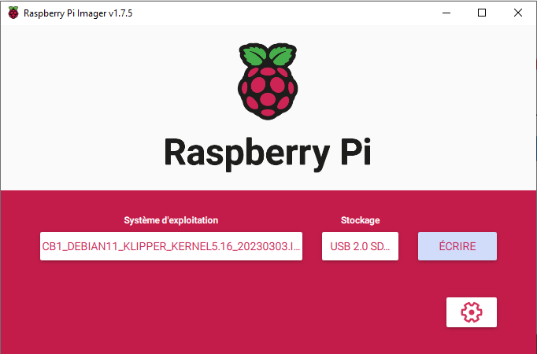
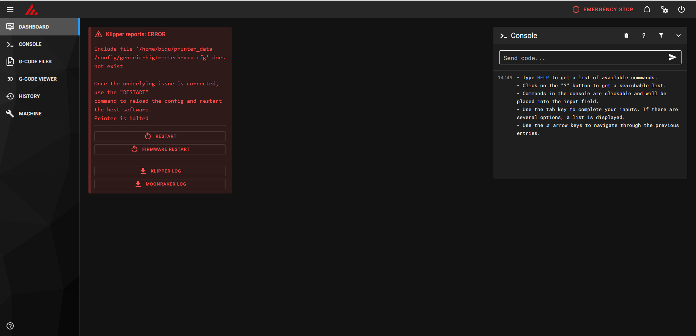
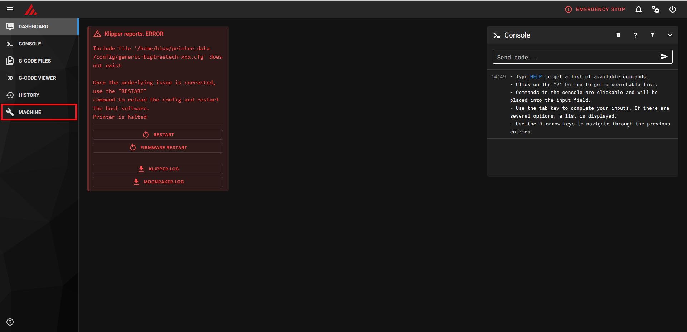

# Configuration de klipper pour une d12 230 mono avec bltouch

Vous trouverez dans ce dépôt l'ensemble des informations nécessaire pour migrer vôtre d12 vers klipper.
Je suis autodidacte sur le sujet, je réalisé ce document tout seul avec les informations que j'ai pu trouver un peu partout.

Pour des soucis économique j'ai fait le fois de partir sur une carte BTT CB1 au lieu d'un raspberry pi 4, si vous avez fait le même choix que moi vous pouvez suivre l'intégralité des étapes.

Pour les utilisateur de raspberry pi 4 je vous invite à suivre cette [vidéo](https://www.youtube.com/watch?v=Ibz9D00NlO8).
Mais aussi si vous avez un vieux pc qui traine c'est le moment de le recycler en y installant une distribution Linux (debian, ubuntu, centos, ...)
puis suivre les instructions sur ce [dépôt](https://github.com/th33xitus/kiauh#-download-and-use-kiauh) pour la partie installation.

Et reprendre à partir de **Copie des fichiers de configurations**

## Resources pour la création de ce projet
Maxime de [I3DM.FR](https://i3dm.fr/2023/03/25/klipper-sur-wanhao-d12/)
La chaine youtube de [Tom's Basement](https://www.youtube.com/@TomsBasement) et sa [playlist sur klipper](https://www.youtube.com/playlist?list=PLG2DUsM4SElSYaGta07jPFdrE_DXlMMff)

## Matériel nécessaire

- [BTT CB1](https://biqu.equipment/collections/control-board/products/pi4b-adapter-v1-0?variant=39847230242914) ou [ou BTT pi v1.2](https://biqu.equipment/products/bigtreetech-btt-pi-v1-2?variant=40326121980002)
- Micro sd
- Cable d'origine de l'imprimante USB-B vers USB-A

optionel mais bien pratique
- [USB Input Shaper](https://fr.aliexpress.com/item/1005005411366555.html?spm=a2g0o.order_list.order_list_main.11.c0355e5bKZAxdP&gatewayAdapt=glo2fra) 
- un [lot de vis M3](https://www.amazon.fr/gp/product/B0BCYW4YTX/ref=ppx_yo_dt_b_search_asin_title?ie=UTF8&psc=1) pour le USB Input Shaper
- avoir imprimé les fichier 3mf dans le dossier [stl_adxl](https://github.com/sheldonGordon/klipper-config/tree/main/stl_adxl), pas nécessaire mais c'est mieux
 
## Installation de klipper sur le BTT CB1 ou BTT pi v1.2
Pour commencer il faut télécharger la dernière image officiel du [CB1](https://github.com/bigtreetech/CB1/releases), et télcharger celle qui commence par "CB1_Debian11_Klipper_kernel..."

Ensuite télécharger [balena etcher](https://etcher.balena.io/) ou [raspberry imager](https://www.raspberrypi.com/software/)

Il est maintenant temps d'écrire l'image du CB1 sur vôtre micro sd.

Connecter vôtre micro sd au pc, puis lancer balena etcher ou raspberry imager, pour mon cas le deuxième fois à très bien fonctionné.

Il suffit alors de choisir le fichier ".img.xz" et la micro sd puis de cliquer sur écrire

Une fois fini, vous un message de succès qui apparaitra.

Si vous souhaitez que vôtre BTT CB1 se connecte au wifi local, il faut ouvrir la partiton **BOOT** créer sur la microsd et éditer le fichier **system.cfg** avec bloc note par exemple, puis modifier les valeur **WIFI_SSID** et **WIFI_PASSWD** par celle de vôtre réseau wifi.

Vous êtes désormais prêt pour installer la micro sd dans le BTT CB1 et le démarrer.

Environ 1 à 2 minutes après votre serveur klipper est prêt.

Pour pouvoir y accéder et commencer à jouer avec, il va falloir vous connecter sur votre box à l'adresse http://192.168.1.1

Et trouver une machine connectée à vôtre réseau avec le nom **BTT-CB1** et de relever son adresse IP.

Dans votre Navigateur essayer d'accéder à cette adresse IP, vous devriez avoir cette page qui apparait.

Félicitations vous avez installer klipper avec succées.
## Copie des fichiers de configurations
Avant de commencer toutes configurations nous allons mettre à jour nôtre système au complet.

Pour cela aller dans l'onglet ***MACHINE***.

Puis dans la partie ***Update Manager***, cliquer sur ***UPDATE ALL COMPONENT***.

Cela aura pour effet de mettre à jour le système d'exploitation mais aussi l'ensemble des composants de klipper

## Modification du fichier de configuration printer.cfg

## Réglage des tensions de courroies et de galets

## Nivellement du bed

## Réglage de l'extruder

## Réaliser les PID

## Installation et Configuration du USB Input Shaper

## Réglage du Pressure Advance
